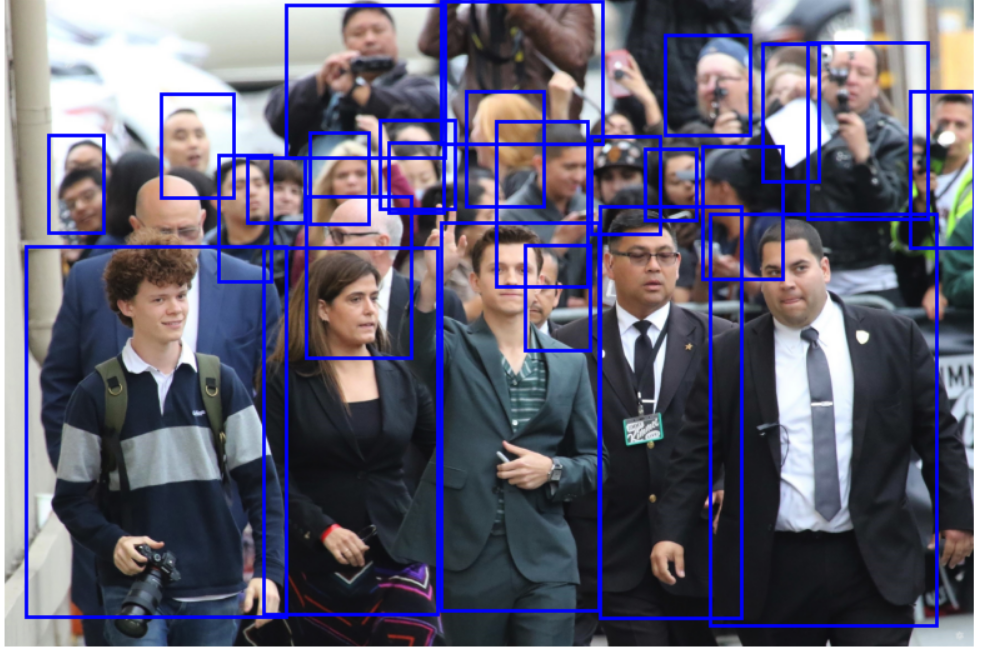
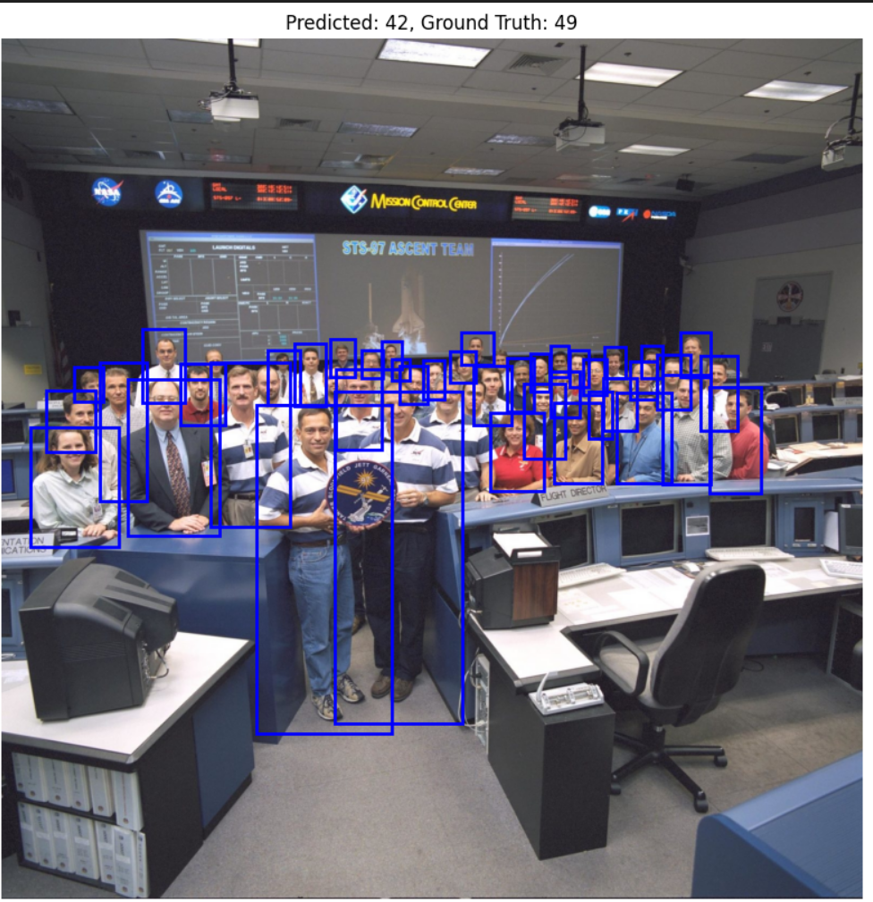
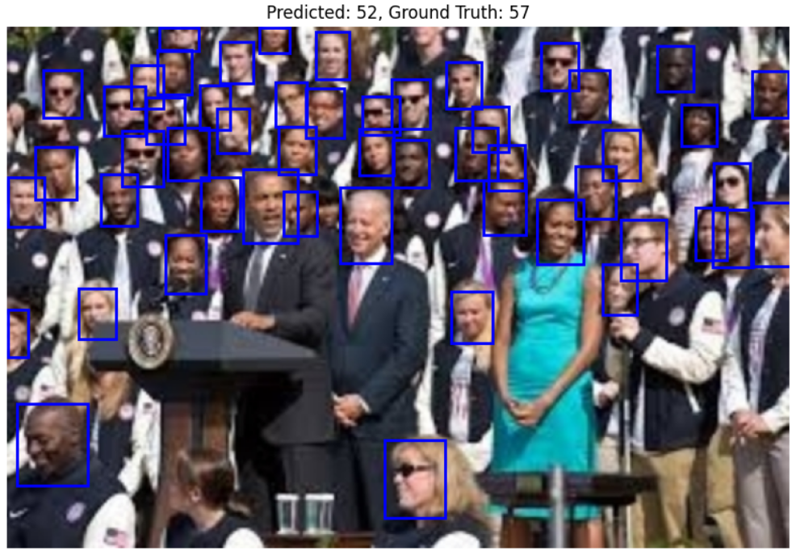
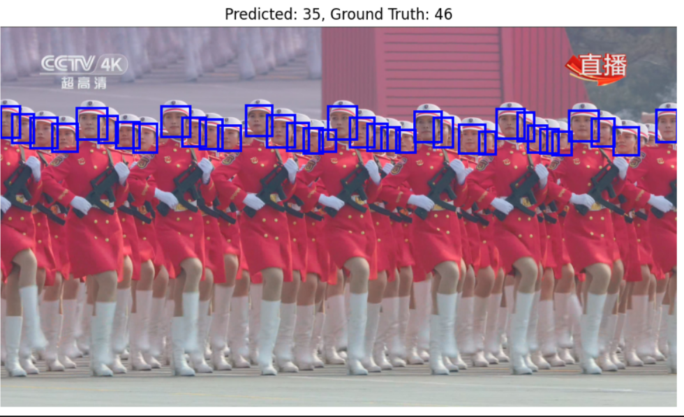

# YOLO-Based Crowd Counting

This repository contains a project for crowd counting using YOLO (You Only Look Once). The goal is to detect and count people in images using a deep learning model trained on a dataset of crowded scenes. This approach provides a real-time estimation of the number of individuals in a given image, making it useful for applications such as crowd monitoring, safety management, and public space analytics.

## Task Overview
Crowd counting is a computer vision problem that involves estimating the number of people present in an image. Traditional methods rely on density estimation, segmentation, or detection-based approaches. This project leverages YOLO, a popular object detection model, to directly detect and count individuals in an image. The model is trained on a dataset of crowded scenes and can generalize to different environments.

## Project Structure
- `best.pt`: The trained YOLO model weights.
- `dataset.yaml`: The dataset configuration file.
- `convert_box.py`, `convert_data.py`: Scripts for preprocessing and converting data into the required format.
- `train_new.py`, `train_nwpu.py`: Scripts to train the YOLO model on different datasets.
- `filterData.ipynb`, `plot_dist.ipynb`, `plot_sample.ipynb`, `visualizing.ipynb`: Jupyter notebooks for data analysis and visualization.

## Demo
Below are some example images showcasing the model's performance:

### Input Image 1

### Input Image 2

### Detection Output 1

### Detection Output 2

